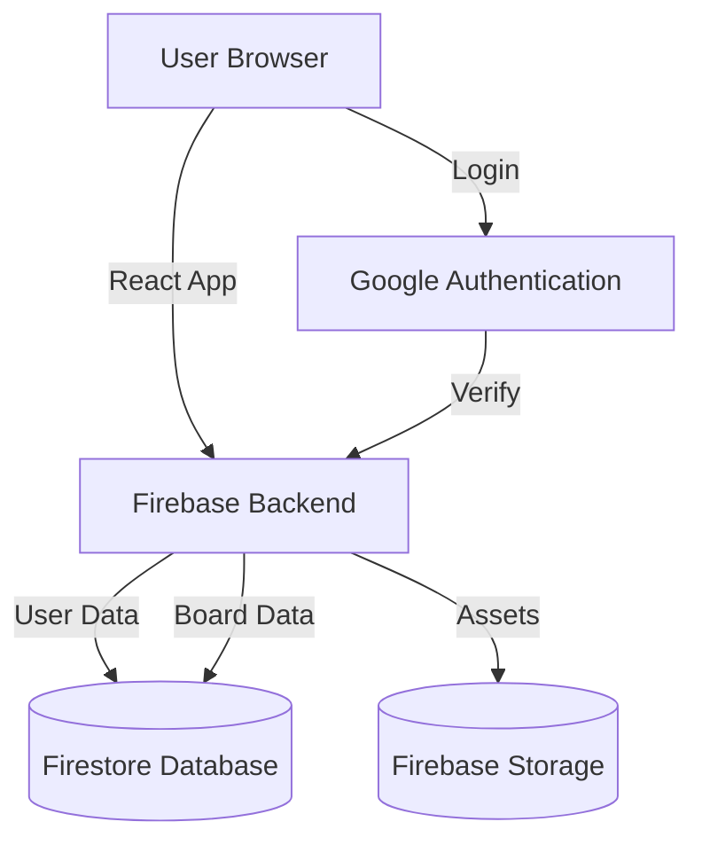
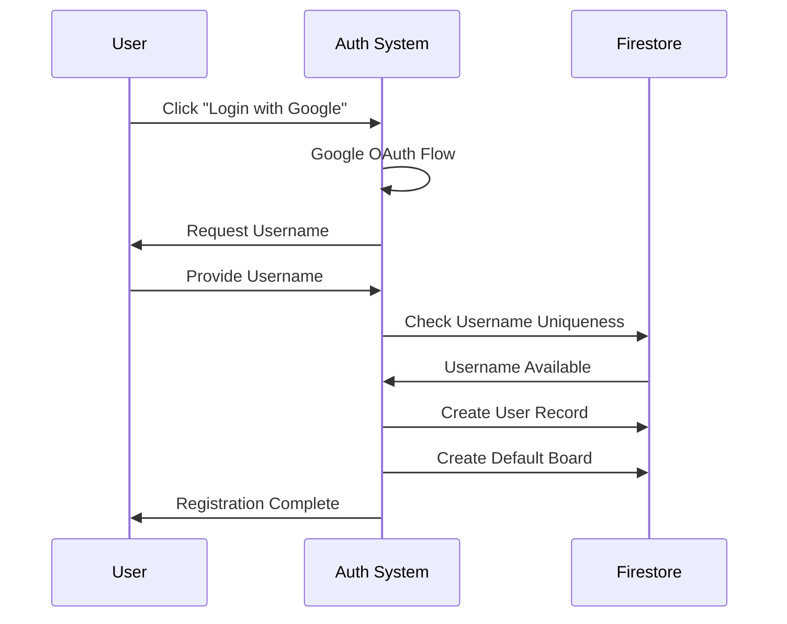
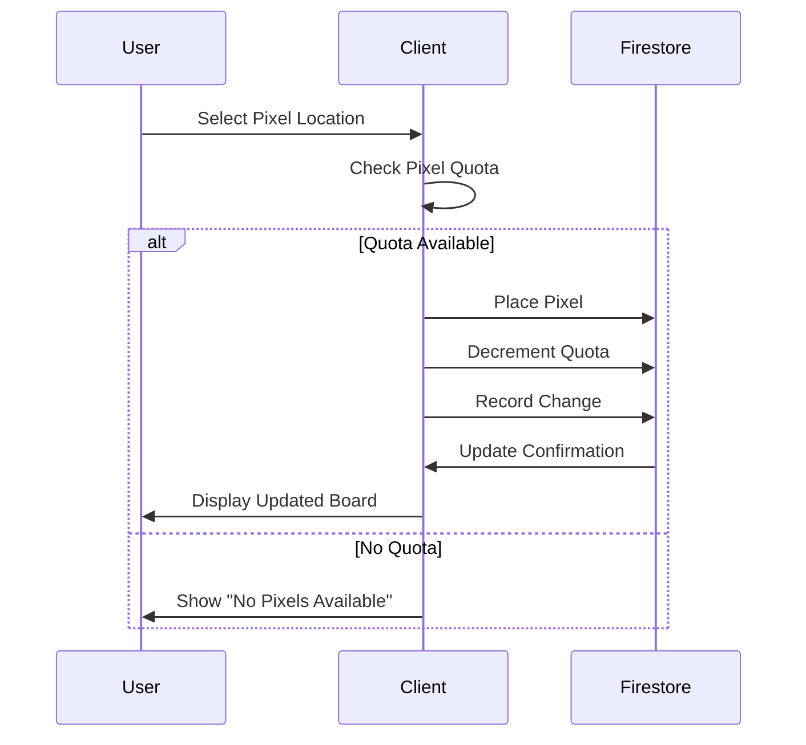

# Software Requirements Specification (SRS)
## tuval.space - Collaborative Pixel Board Platform

---

## 1. Introduction

### 1.1 Purpose
This document specifies the functional and non-functional requirements for tuval.space, a collaborative pixel board platform where members can place pixels on various boards with a daily quota system.

### 1.2 Scope
tuval.space is a web-based platform that allows users to create and modify pixel boards collaboratively. The system manages pixel quotas, user authentication, multiple boards per user, and change history tracking.

### 1.3 Definitions and Acronyms
- **Board**: A canvas where users can place pixels
- **Pixel Quota (X)**: Daily allocation of pixels each member receives
- **Guest**: Non-authenticated visitor with read-only access
- **Member**: Authenticated user with pixel placement rights

---

## 2. System Overview

### 2.1 System Description
A real-time collaborative pixel art platform where:
- Users receive a daily pixel quota
- Pixels can be used across multiple independent boards
- Unused pixels accumulate up to 3X limit
- Each user can manage up to 10 boards
- All changes are tracked and can be reviewed

### 2.2 System Architecture



---

## 3. Functional Requirements

### 3.1 User Management

#### 3.1.1 Authentication
- **FR-1.1**: System shall support Google authentication
- **FR-1.2**: System shall require only username during registration
- **FR-1.3**: Username must be globally unique across all boards
- **FR-1.4**: Guest users shall have read-only access to all boards

#### 3.1.2 User Profiles
- **FR-2.1**: Each member shall have exactly one username
- **FR-2.2**: Username cannot be changed if a board with that name exists
- **FR-2.3**: Users shall be able to create up to 10 boards maximum

### 3.2 Board Management

#### 3.2.1 Board Creation
- **FR-3.1**: System shall automatically create one board upon user registration matching their username
- **FR-3.2**: Users can create additional boards (up to 10 total)
- **FR-3.3**: All boards operate independently of each other
- **FR-3.4**: System shall support special event boards (e.g., New Year's board with 36,500 pixels)

#### 3.2.2 Board Access
- **FR-4.1**: Members can view and edit any board
- **FR-4.2**: Guests can view all boards but cannot make modifications
- **FR-4.3**: Board URLs shall be publicly accessible

### 3.3 Pixel Quota System

#### 3.3.1 Daily Allocation
- **FR-5.1**: Each member receives X pixels per day
- **FR-5.2**: Unused pixels carry over to the next day
- **FR-5.3**: Maximum pixel accumulation is 3X
- **FR-5.4**: Pixel quota is shared across all boards (not per-board)

#### 3.3.2 Pixel Usage
- **FR-6.1**: Pixels spent on one board reduce the total available quota
- **FR-6.2**: System shall prevent pixel placement when quota is exhausted
- **FR-6.3**: System shall display remaining pixel quota to users

### 3.4 Change History

#### 3.4.1 Change Tracking
- **FR-7.1**: All pixel placements shall be recorded with timestamp and user
- **FR-7.2**: Change history shall be accessible via top-right corner interface
- **FR-7.3**: Changes made within 8 hours shall be automatically merged
- **FR-7.4**: Users can individually close/dismiss change entries

#### 3.4.2 Change Visualization
- **FR-8.1**: System shall display chronological list of changes
- **FR-8.2**: Each change entry shall show: user, timestamp, and affected pixels
- **FR-8.3**: Merged changes shall be displayed as a single grouped entry

---

## 4. Non-Functional Requirements

### 4.1 Performance
- **NFR-1.1**: Board updates shall be reflected in real-time (< 1 second latency)
- **NFR-1.2**: System shall support concurrent users modifying different boards
- **NFR-1.3**: Page load time shall be < 3 seconds on standard broadband

### 4.2 Scalability
- **NFR-2.1**: System shall use Firebase free tier efficiently
- **NFR-2.2**: Architecture shall support horizontal scaling if needed

### 4.3 Usability
- **NFR-3.1**: Interface shall be intuitive and require no training
- **NFR-3.2**: System shall be responsive across desktop and mobile devices
- **NFR-3.3**: UI components shall follow shadcn/ui design system

### 4.4 Security
- **NFR-4.1**: All authentication shall be handled via Google OAuth
- **NFR-4.2**: User actions shall be validated server-side
- **NFR-4.3**: Guests shall have no write permissions enforced at backend level

### 4.5 Maintainability
- **NFR-5.1**: Code shall follow TypeScript best practices
- **NFR-5.2**: All code shall pass ESLint and Prettier checks
- **NFR-5.3**: Commit messages shall follow commitlint standards
- **NFR-5.4**: Pre-commit hooks shall enforce code quality (husky, lint-staged)

### 4.6 Reliability
- **NFR-6.1**: System shall have 99% uptime
- **NFR-6.2**: Data loss shall be prevented through Firebase persistence
- **NFR-6.3**: Optimistic updates with rollback on failure

---

## 5. Technical Stack

### 5.1 Frontend
- **Framework**: React with TypeScript
- **Build Tool**: Vite
- **Styling**: Tailwind CSS
- **UI Components**: shadcn/ui
- **Icons**: react-icons

### 5.2 Backend & Infrastructure
- **Backend**: Firebase (Firestore, Authentication)
- **Hosting**: GitHub Pages / GitHub Actions
- **Authentication**: Google OAuth

### 5.3 Development Tools
- **Testing**: Jest
- **Documentation**: Storybook
- **Linting**: ESLint, Prettier
- **Git Hooks**: Husky, lint-staged, commitlint

---

## 6. User Stories

### 6.1 Member Stories
- **US-1**: As a member, I want to login with Google so I can access the platform easily
- **US-2**: As a member, I want to see my remaining pixel quota so I know how many pixels I can place
- **US-3**: As a member, I want unused pixels to carry over so I don't lose my daily allocation
- **US-4**: As a member, I want to create multiple boards so I can organize different projects
- **US-5**: As a member, I want to view change history so I can see recent modifications

### 6.2 Guest Stories
- **US-6**: As a guest, I want to view boards without logging in so I can explore the platform
- **US-7**: As a guest, I want to see who made changes so I understand the community activity

---

## 7. Data Models

### 7.1 User Entity
```typescript
interface User {
  uid: string;
  username: string;
  email: string;
  pixelQuota: number;
  lastQuotaReset: Timestamp;
  createdAt: Timestamp;
  boards: string[]; // Array of board IDs (max 10)
}
```

### 7.2 Board Entity
```typescript
interface Board {
  id: string;
  name: string;
  ownerId: string;
  width: number;
  height: number;
  pixels: Pixel[][];
  createdAt: Timestamp;
  isSpecialEvent: boolean;
  specialEventPixels?: number;
}
```

### 7.3 Pixel Entity
```typescript
interface Pixel {
  color: string; // Hex color code
  placedBy: string; // User ID
  placedAt: Timestamp;
}
```

### 7.4 Change Entity
```typescript
interface Change {
  id: string;
  userId: string;
  username: string;
  boardId: string;
  pixels: PixelChange[];
  timestamp: Timestamp;
  mergedWith?: string[]; // IDs of merged changes
  isDismissed: boolean;
}

interface PixelChange {
  x: number;
  y: number;
  oldColor: string;
  newColor: string;
}
```

---

## 8. Constraints & Assumptions

### 8.1 Constraints
- Must use Firebase free tier
- Maximum 10 boards per user
- Maximum pixel accumulation of 3X
- Changes within 8 hours are merged
- Username must be unique globally

### 8.2 Assumptions
- Users have modern web browsers (Chrome, Firefox, Safari, Edge)
- Users have Google accounts for authentication
- Internet connectivity is available
- Daily pixel quota (X value) will be configured by administrators
- Board dimensions will be defined during implementation

---

## 9. Future Enhancements (Out of Scope)
- Social features (comments, likes, followers)
- Board templates
- Pixel trading/gifting between users
- Mobile native applications
- Undo/redo functionality
- Collaborative drawing tools
- User roles and permissions (moderators, admins)
- Private boards with access control
- Board export/import functionality
- Animation support for boards

---

## 10. Acceptance Criteria

### 10.1 MVP Requirements
- ✓ Google authentication working
- ✓ Users can create username and default board
- ✓ Pixel placement with quota management
- ✓ Real-time board updates
- ✓ Guest view-only access
- ✓ Change history visible and mergeable
- ✓ Responsive UI with shadcn/ui
- ✓ Deployed via GitHub
- ✓ Users can create up to 10 boards
- ✓ Pixel quota carries over and caps at 3X

### 10.2 Testing Requirements
- Unit tests for core logic (Jest)
- Integration tests for Firebase interactions
- UI component tests (Storybook)
- End-to-end testing for critical user flows
- Performance testing for concurrent users

---

## 11. System Workflows

### 11.1 User Registration Flow


### 11.2 Pixel Placement Flow


---

## 12. URL Structure

### 12.1 Routes
- `/` - Landing page / Browse boards
- `/login` - Authentication page
- `/board/:boardName` - View specific board
- `/user/:username` - User profile and boards
- `/create-board` - Create new board
- `/history` - Change history panel (overlay)

---

## 13. Board Specifications

### 13.1 Standard Board
- Dimensions: TBD (e.g., 1000x1000 pixels)
- Daily quota: X pixels per user
- Accumulation cap: 3X pixels

### 13.2 Special Event Board (New Year Example)
- Total pixels: 36,500 (365 days × 100 pixels)
- Available for limited time
- Same accumulation rules apply

---

## 14. Change Merging Rules

### 14.1 Merge Logic
- Changes by same user within 8 hours are merged
- Merged changes maintain chronological order
- Individual changes within merged group can be dismissed
- Dismissal persists per-user basis

### 14.2 Display Rules
- Show most recent change timestamp for merged entries
- Indicate number of merged changes in UI
- Allow expansion to see individual changes

---

## 15. Glossary

| Term | Definition |
|------|------------|
| Board | A pixel canvas that users can collaboratively edit |
| Pixel Quota | The number of pixels a user can place per day |
| Guest | Unauthenticated user with read-only access |
| Member | Authenticated user with pixel placement rights |
| Change | A recorded pixel placement or modification |
| Merge | Automatic grouping of changes within 8-hour window |
| Carry Over | Unused pixels that accumulate to next day |
| Cap | Maximum pixel accumulation limit (3X) |

---

**Document Version**: 1.0  
**Last Updated**: December 16, 2025  
**Status**: Draft for Implementation

